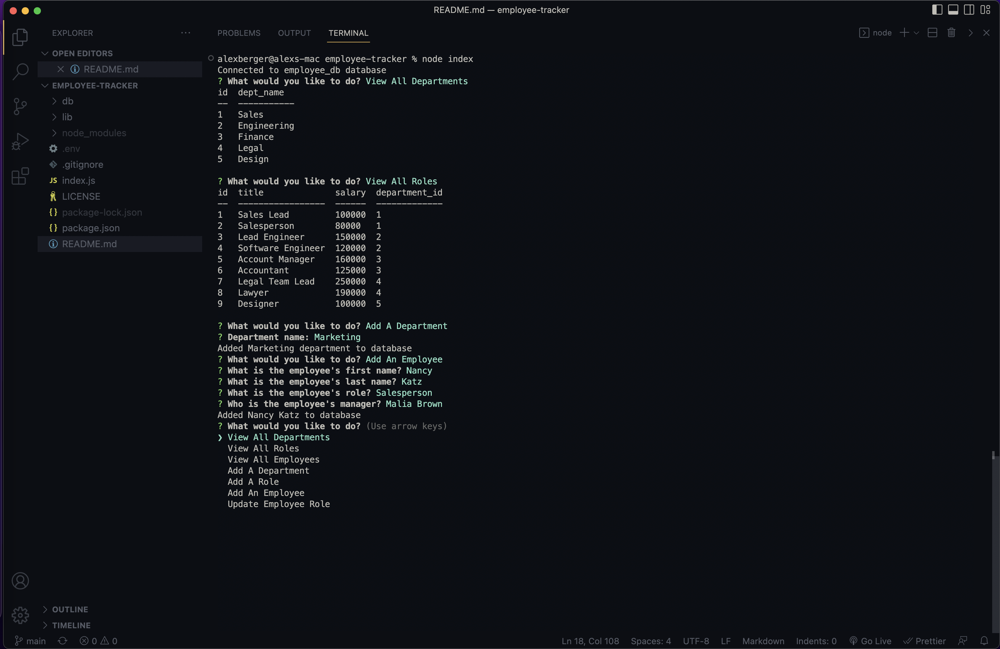

# Employee Tracker

## Description
 A CLI using Node.js, Inquirer and MySQL that allows the user to view and manage the departments, roles, and employees in a company.
  
## Table of Contents
- [Preview](#preview)
- [Installation](#installation)
- [Screenshot](#screenshot)
- [License](#license)
- [Questions](#questions)

## Preview
This [walkthrough video](https://drive.google.com/file/d/1stdl7lGgsUkzKZMC6NaiZ3yndGf9RLad/view?usp=sharing) demonstrates the application functionality.

## Installation
Install dependencies with `npm i`. Update the database password in the `.env` file. Create the database by starting MySQL with `mysql -u root -p` and running `SOURCE db/schema.sql;`. Seed the database by running `SOURCE db/seeds.sql;`. Run the application with `node index`.

## Screenshot

## License
Learn more about [MIT](https://choosealicense.com/licenses/mit/).
  
## Questions
GitHub Username: aberger3647

You can reach me with any questions at aberger3647@gmail.com
